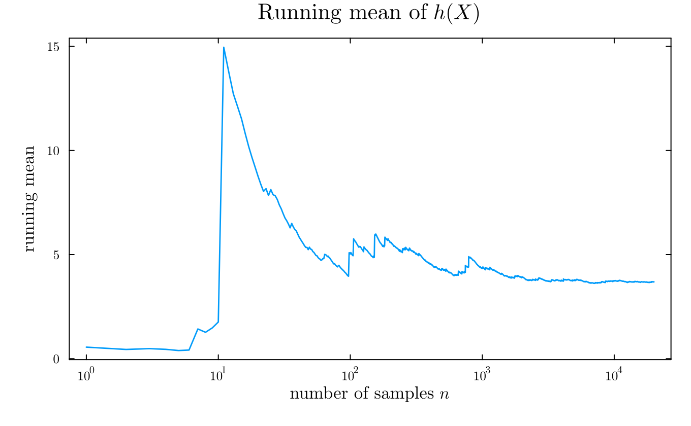

::: {.callout-important icon=false}
### Due: Thursday 11 February 2027, 9:00pm Eastern

Submit a PDF to Gradescope with **each sub-part tagged**. Untagged submissions lose 10%.

**20 points.** Problems 1 and 2 are pen-and-paper (14 points). Problem 3 is computational (6 points).
:::

## Problem 1 — A Monte Carlo estimate you have to defend (7 points)

You are estimating $m = \mathbb{E}[h(X)]$, the probability that a tide gauge exceeds a threshold in
a given year, by drawing $X_1,\dots,X_n$ from a fitted distribution and forming
$$\hat{m}_n = \frac{1}{n}\sum_{i=1}^n h(X_i).$$

**(a) (2 points)** What does it mean to say $\hat{m}_n$ is an **unbiased** estimator of $m$? State
what the law of large numbers guarantees about $\hat{m}_n$, and state one thing it does **not**
guarantee.

**(b) (2 points)** You estimate that the standard deviation of $h(X)$ is $5$. How many samples do you
need for a standard error of $0.1$? **Give the relation between $n$ and the standard error**, not
only the number.

**(c) (3 points)** You run the estimator twice, once with $n = 1{,}000$ and once with
$n = 100{,}000$, and get different answers.

  i. Which do you trust more, and why?
  ii. What would you report alongside the estimate?
  iii. What would make you distrust **both**?

## Problem 2 — Short questions (7 points)

**(a) (2 points)** The figure below shows the running mean $\hat{m}_n$ against $n$ on a log scale.
Has the estimator converged? **Justify your answer from features of the plot**, not from the value
it appears to settle at.

{width=85%}

**(b) (2 points)** Mark each statement **true** or **false**. For each false statement, correct it in
a phrase.

  i. Doubling $n$ halves the Monte Carlo standard error.
  ii. The Monte Carlo standard error tells you how far $\hat{m}_n$ is from $m$.
  iii. The Monte Carlo standard error can be made arbitrarily small by increasing $n$.
  iv. If $h(X)$ has infinite variance, the standard error formula still applies.

**(c) (3 points)** You simulate from a distribution to estimate an expectation. Write down what you
are assuming (i) about the sampler and (ii) about $h$. For **each**, name what goes wrong if the
assumption fails.

## Problem 3 — Estimating an exceedance probability (6 points)

Use the annual maxima you produced in Homework 1, keeping only years with at least 8,000 recorded
hours. (`data/annual_maxima.csv` is provided if you would rather not recompute them.)

**(a) (2 points)** Fit a normal distribution to the annual maxima by matching the mean and standard
deviation. Report both. Then compute, **analytically**, the probability that a year's maximum exceeds
**1.5 m** under this fitted distribution.

**(b) (3 points)** Now estimate the same probability by **Monte Carlo**: draw $N$ values from the
fitted distribution and take the fraction exceeding 1.5 m. Do this for
$N = 10^2, 10^3, 10^4, 10^5$.

For each $N$, report the estimate **and its standard error**. Present the four results as a small
table, and say in one sentence whether the errors behave as Problem 1(b) predicts.

**(c) (1 point)** Compare your answers to the **observed** fraction of years in the record that
exceeded 1.5 m. In one sentence: what would it mean if these disagreed badly?

